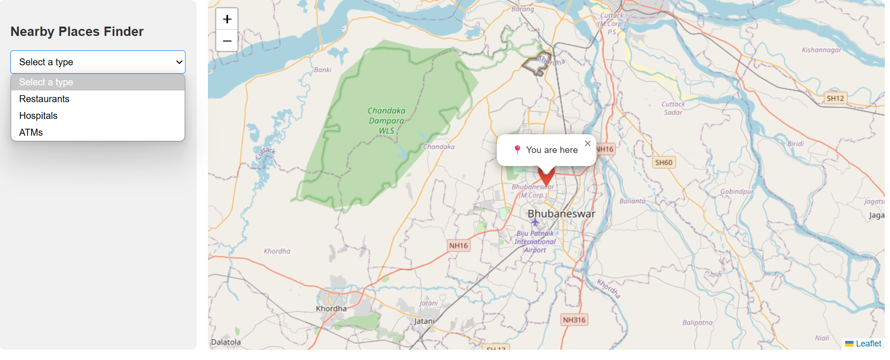
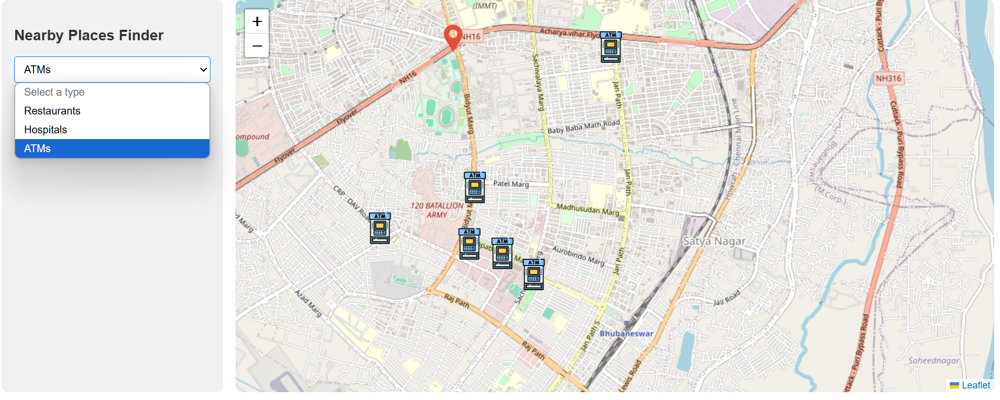

# AngularGeolocationApp

A simple Angular app that shows nearby places like ATMs, hospitals, and restaurants based on your current location using Leaflet, OpenStreetMap, and Overpass API.

## 🚀 Features

- Detects your current location
- Dropdown to choose place type (ATM, hospital, restaurant, etc.)
- Fetches nearby results dynamically using Overpass API
- Displays custom markers on the map
- Popups with place info

## 🧰 Tech Stack

- **Angular** – Front-end framework
- **Leaflet.js** – To display the map and markers
- **OpenStreetMap** – Map tile provider
- **Overpass API** – To query OpenStreetMap data for nearby amenities (like `amenity=restaurant`)
- **HTML5 Geolocation API** – To detect user's current location

## 📷 Screenshots

### 🟢 Default Map View

This is the initial map view showing your current location.



---

### 🏧 ATM Locations View

After selecting "ATM" from the dropdown, nearby ATM locations are shown with custom markers.



## 🔧 Setup

```bash
npm install
ng serve
```
